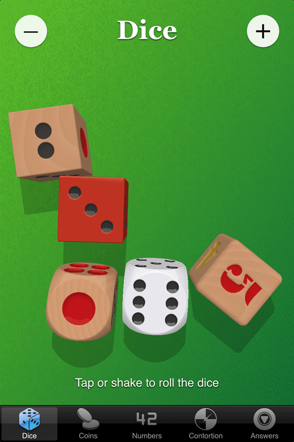
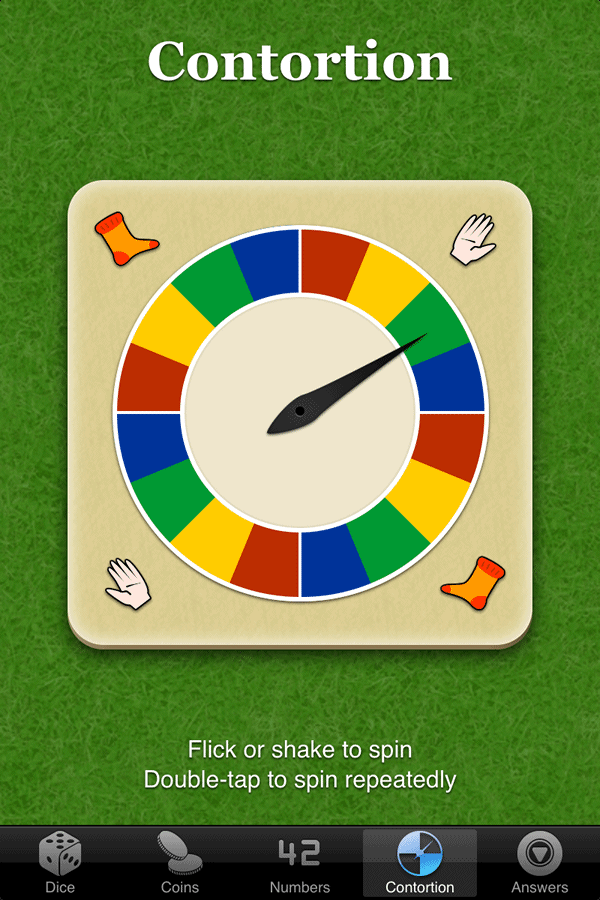
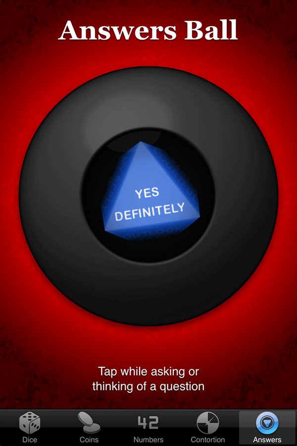

# Chance

Various simulations of chance-related physical objects. Serves as a
playground for rendering techniques.

Supports desktop and mobile browsers. Optimised for iOS and can be
added to the home screen.

## Screens

### Dice



Rigid-body-physics simulation with custom WebGL shaders defining the
dice shapes and reflections.

* Uses [GoblinPhysics](https://github.com/chandlerprall/GoblinPhysics)
  for the physics simulation
* Seeds dice with uniform random rotations to ensure randomness
* Variety of dice materials and shapes
  - Wood (varnished and unvarnished)
  - Plastic (white and red)
  - Sharp square
  - Smooth square
  - Truncated square
  - Rounded square
* Uses normal mapping and parallax mapping on the dice faces for
  realistic dot rendering
* Uses raytracing to render rounded dice shapes

### Coins

Work in progress; uses normal mapping and parallax mapping to render
coin faces, and raytracing to render coin edge. Physics / animation
not implemented yet

### Numbers

Work in progress.

### Contortion



Simple friction simulation with WebGL used to render a motion-blurred
needle.

* Picks a target segment in advance, allowing the spinner to avoid
  states which have already been chosen
* Calculates initial velocity required to reach target state
* When flicked by hand, ensures roughly the correct number of spins
  are seen to make it feel more closely related to how much force the
  user imparted
* WebGL rendering allows cheap and realistic motion blur

### Answers Ball



Icosahedron-inside-cylinder simulation rendered using WebGL with custom
fog simulating coloured liquid.

* Uses accelerometer and gyroscope readings if available for realistic
  movement
* When out of sight, applies uniform random rotation to icosahedron to
  ensure randomness
* Layer-based volumetric rendering allows realistic appearance; letters
  are raised above icosahedron surface and colouring is provided
  entirely by distance from the camera (liquid depth)

## Running Locally

Due to the use of web modules, this project cannot be served from the
filesystem directly; a web server must be used. A simple example:

```
npm install -g http-server;
http-server . -p 8080 -o;
```
